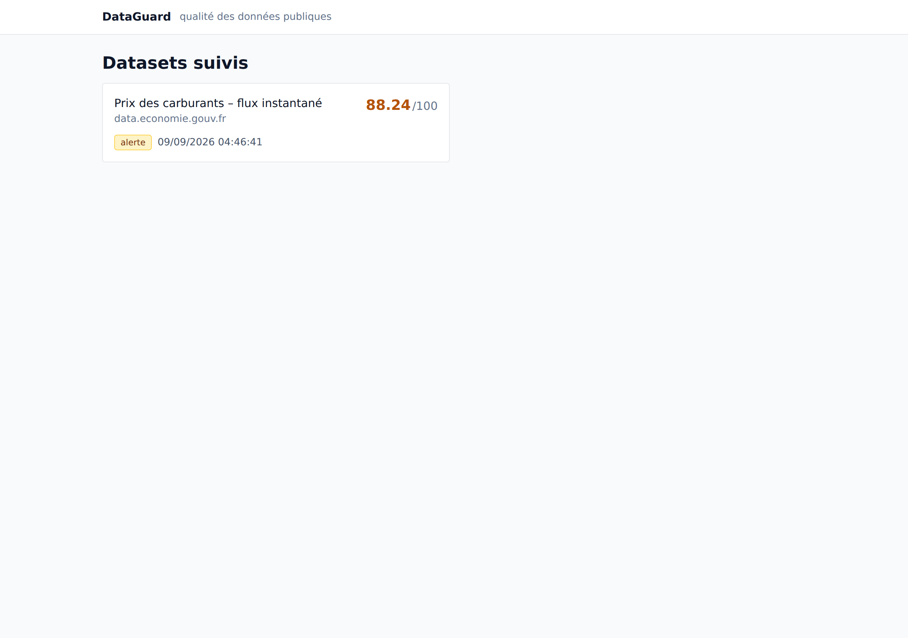
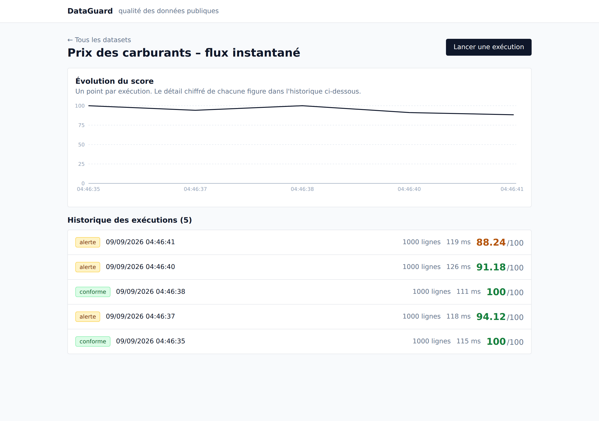
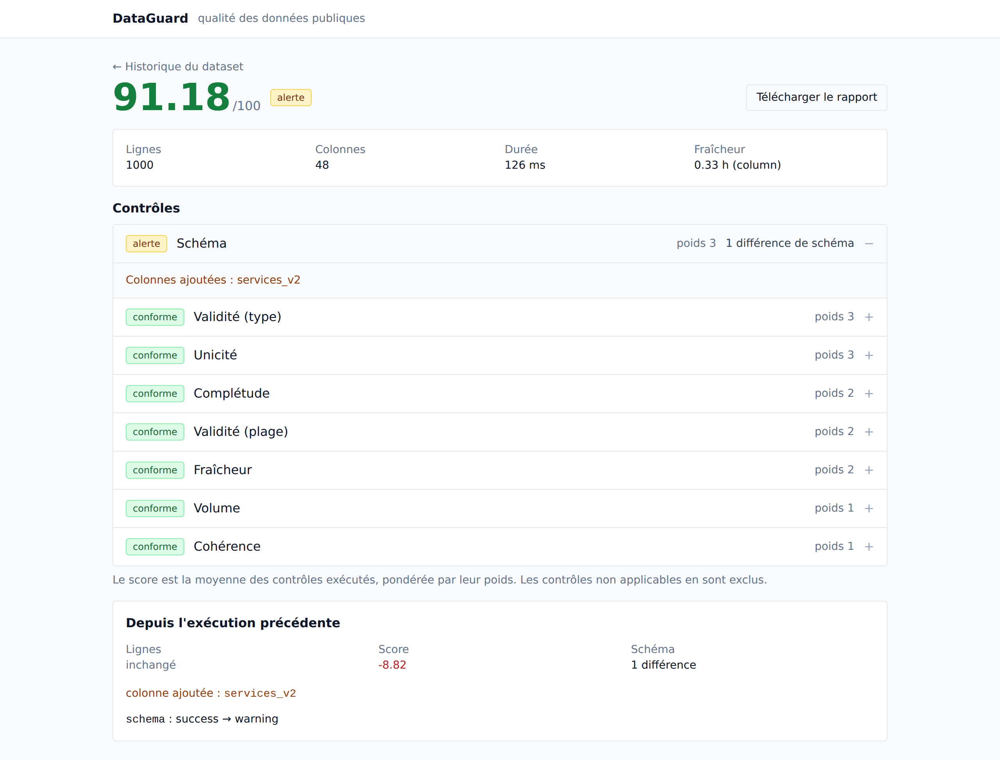

# DataGuard

Plateforme de qualité et d'observabilité des données publiques. Elle ingère un jeu de données, exécute huit contrôles, calcule un score expliqué, compare chaque exécution à la précédente et expose le tout via une API documentée et un dashboard.

Elle répond à deux questions : **puis-je faire confiance à cette source ?** et **qu'est-ce qui a changé depuis la dernière fois ?**

## Le problème

Les données ouvertes sont utiles mais rarement irréprochables : colonnes manquantes, doublons, types incohérents, fichiers qui ne sont plus mis à jour, colonnes renommées sans prévenir. Un tableau de bord construit directement dessus affiche alors des résultats faux, sans que personne ne sache pourquoi ni depuis quand.

DataGuard s'intercale avant : il mesure ce qu'il peut mesurer, le dit clairement, et signale ce qui a bougé.

## Ce qu'il ne fait pas

Il ne vérifie pas l'exactitude métier. Un prix de carburant à 2,15 € peut respecter le format, la plage et la fraîcheur tout en étant faux dans le monde réel. DataGuard signale ce qui est mesurable et ne prétend pas valider ce qu'il ne peut pas connaître. Le score reflète des contrôles de forme, pas la véracité de la donnée.

## À quoi ça ressemble

Captures prises sur une session réelle, avec les jeux de données synthétiques.



La page d'accueil liste les datasets suivis avec le statut et le score de leur
dernière exécution. Un statut est toujours écrit, jamais seulement coloré.



L'historique d'un dataset. La courbe relie les exécutions par segments droits et
non par une spline : une interpolation lissée dessinerait entre deux exécutions
des valeurs qui n'ont jamais été mesurées. L'échelle reste ancrée à zéro — ici,
cinq exécutions entre 88 et 100, ce qui se lit comme une qualité constamment
haute plutôt que comme une chute dramatique.



Le détail d'une exécution : le score avec le poids de chaque contrôle, le détail
déplié de celui qui a levé une alerte, et en bas ce qui a changé depuis
l'exécution précédente — ici une colonne `services_v2` apparue, et le contrôle de
schéma passé de conforme à alerte.

## Démarrage

Un seul prérequis pour faire tourner le projet : Docker. Depuis la racine du dépôt.

```bash
cp .env.example .env                      # Windows : copy .env.example .env
docker compose run --rm --no-deps api python scripts/generate_samples.py
docker compose up --build
```

La deuxième commande n'est pas facultative : les fichiers de test ne sont pas
versionnés, et `data/sample` est vide après un clone. Elle s'exécute dans le
conteneur, qui embarque déjà Pandas — inutile d'installer Python sur la machine
pour cela. Avec Python disponible localement, `python scripts/generate_samples.py`
fait la même chose plus vite.

Python 3.11 ou plus reste nécessaire pour l'outillage de développement : tests,
lint, migrations hors conteneur.

Au premier lancement, le build prend quelques minutes. Ensuite :

- documentation interactive de l'API : http://localhost:8000/docs
- dashboard : http://localhost:5173

Le dashboard affiche « Aucun dataset suivi » tant que la démonstration n'est pas
préparée — c'est normal, voir la section suivante.

`make` n'existe pas sous Windows ; le `Makefile` n'est qu'un raccourci pour les
commandes ci-dessus, chacune reste utilisable telle quelle.

### Sans Docker

Il faut un PostgreSQL 16 joignable et les variables de `.env` renseignées, puis :

```bash
cd backend && pip install -e ".[dev]" && alembic upgrade head
uvicorn app.main:app --reload
cd ../frontend && npm install && npm run dev
```

## Démonstration

Une fois les conteneurs démarrés, dans un second terminal :

```bash
docker compose exec api python -m app.cli seed
```

La commande crée la source et le dataset, et affiche son identifiant. Elle est
idempotente : la relancer ne crée pas de doublon.

Puis le scénario, en reprenant l'identifiant affiché :

```bash
docker compose exec api python -m app.cli run <dataset-id> --file data/sample/clean.csv
docker compose exec api python -m app.cli run <dataset-id> --file data/sample/schema_removed.csv
docker compose exec api python -m app.cli run <dataset-id> --file data/sample/stale.csv
docker compose exec api python -m app.cli run <dataset-id> --file data/sample/empty.csv
```

Attendu, dans l'ordre : score de 100 et statut conforme ; échec du contrôle de
schéma, colonne `Prix GPLc` signalée disparue ; échec de fraîcheur, donnée
vieille de dix jours ; enfin un run en échec sans aucun score, le fichier vide
étant rejeté avant les contrôles.

Le dashboard montre ensuite l'historique, la courbe de score, le détail de
chaque contrôle et la comparaison entre deux exécutions successives.

Les fichiers de test portent des dates absolues et vieillissent : la fraîcheur
se mesure par rapport à l'instant présent. Au-delà de 36 heures, le fichier
propre passe en alerte ; au-delà de 72 heures, en échec — sans qu'aucun code
soit en cause. Régénérez-les avant de reprendre la démonstration :

```bash
docker compose run --rm --no-deps api python scripts/generate_samples.py
```

### Sur la source réelle

`docker compose exec api python -m app.cli run <dataset-id>` sans `--file`
télécharge le fichier depuis data.economie.gouv.fr — environ 20 Mo, sous la
limite de 50 Mo. C'est le seul cas où le projet a besoin d'un accès réseau.

## Les huit contrôles

| Contrôle | Dimension | Poids | Ce qu'il détecte |
|---|---|---|---|
| `schema` | Schéma | 3 | colonne ajoutée, supprimée, renommée, changée de type |
| `types` | Validité (type) | 3 | valeurs non convertibles vers le type déclaré |
| `uniqueness` | Unicité | 3 | doublons sur la clé déclarée |
| `completeness` | Complétude | 2 | valeurs absentes au-delà du seuil de la colonne |
| `ranges` | Validité (plage) | 2 | valeurs hors bornes, hors liste, hors motif |
| `freshness` | Fraîcheur | 2 | donnée plus ancienne que la fréquence attendue |
| `volume` | Volume | 1 | variation anormale du nombre de lignes |
| `consistency` | Cohérence | 1 | règles inter-colonnes (date dans le futur, par exemple) |

Le détail des seuils et la formule du score sont dans [`docs/quality_rules.md`](docs/quality_rules.md).

## Le score, et ce qu'il vaut

`score = Σ(poids × contribution) / Σ(poids) × 100`, où un contrôle conforme contribue 1, une alerte 0,5, un échec 0. Les contrôles non applicables sont exclus du calcul plutôt que comptés comme des échecs.

Trois précautions qui comptent plus que la formule :

- le score n'est jamais affiché sans le détail des contrôles qui le composent ;
- les poids employés sont recopiés dans chaque résultat, si bien qu'une exécution consultée dans six mois reste explicable même si la configuration a changé entre-temps ;
- un run techniquement échoué n'a pas un score de 0 mais **pas de score du tout** : un fichier vide n'a pas une qualité nulle, il n'a pas de qualité mesurée.

## La source

Prix des carburants en France, flux instantané v2, publié par le ministère de l'Économie sous [Licence Ouverte 2.0](https://data.economie.gouv.fr/explore/dataset/prix-des-carburants-en-france-flux-instantane-v2/). Elle a été retenue parce qu'elle exerce réellement les huit contrôles : un identifiant de station pour l'unicité, six colonnes de prix pour les types et les plages, six colonnes de date de mise à jour pour une fraîcheur fondée sur le contenu et non sur le fichier, et des carburants non distribués partout — donc des valeurs absentes légitimes, ce qui oblige à distinguer l'absence attendue de l'absence anormale.

Trois particularités relevées sur le fichier réel et prises en compte dans la configuration :

- les coordonnées sont exprimées en degrés décimaux multipliés par 100 000 (`4818300` vaut 48,183°), ce qui invalide toute borne naïve à ±90 ;
- les codes postaux doivent être lus en texte, faute de quoi les départements 01 à 09 perdent leur zéro initial ;
- **la même source s'exporte sous deux nommages de colonnes différents** : le portail livre des libellés (`Prix Gazole`, `Code postal`), l'API livre des identifiants techniques (`gazole_prix`, `cp`), sauf à demander `use_labels=true`. Trente-six colonnes sur quarante-sept changent de nom d'un mode à l'autre. La configuration est bâtie sur les libellés et l'URL de la source demande donc explicitement ce paramètre.

Ce troisième point n'a pas été trouvé en lisant la documentation mais en exécutant l'outil : le contrôle de schéma a signalé les trente-six renommages au premier run sur la source réelle. C'est précisément le genre de rupture silencieuse que DataGuard existe pour attraper.

Aucun CSV n'est versionné, ni export réel ni fichier synthétique : le dépôt ne contient que de quoi les reconstruire — le générateur, le schéma de référence relevé sur la source, et la configuration du dataset.

## Les fichiers de test

`scripts/generate_samples.py` produit dix-sept fichiers reprenant les 47 colonnes réelles. Ils ne sont pas versionnés — 13 Mo de contenu entièrement reconstructible — donc après un clone, `make samples` avant tout le reste. Chacun ne porte qu'une seule famille d'anomalie, ce qui permet à un test échoué de désigner un seul contrôle. À graine fixe et à `--now` identique, deux exécutions produisent des fichiers octet pour octet identiques.

## Architecture

```
Source (URL ou fichier)
   ↓ ingestion      https uniquement, limite de taille, checksum SHA-256
   ↓ profilage      lecture en texte, schéma observé, volume
   ↓ contrôles      huit contrôles indépendants, score, statut
   ↓ comparaison    diff avec l'exécution précédente
   ↓ persistance    PostgreSQL
   ↓ API            FastAPI, contrat OpenAPI
   ↓ dashboard      React / TypeScript
```

Les étapes ne se connaissent pas : le moteur de contrôles ignore l'existence de la base et de l'API, ce qui permet de le tester sans rien démarrer et d'ajouter un contrôle sans toucher au reste.

Détail dans [`docs/architecture.md`](docs/architecture.md), décisions et raisons dans [`docs/adr/`](docs/adr/).

## Développement

```bash
make test      # tests backend
make lint      # ruff
make samples   # régénère les fichiers synthétiques
make openapi   # exporte le contrat et régénère les types du dashboard
```

Les types TypeScript sont engendrés depuis le contrat OpenAPI et vérifiés en CI : un changement d'API casse le build du dashboard au lieu de casser l'affichage une fois en ligne.

## État et mesures

Ce qui est fait : ingestion, profilage, les huit contrôles, score, comparaison, persistance, API, dashboard, CLI, Docker, CI.

Mesures relevées sur cette version, sur les fichiers synthétiques de 1 000 lignes et 47 colonnes :

| Mesure | Valeur |
|---|---|
| Durée d'une exécution complète | 112 à 136 ms |
| Tests backend | 91 |
| Tests frontend | 25 |
| Contrôles exécutés par run | 8 |
| Score du fichier propre | 100 |

Sur la source réelle — 9 805 lignes, 47 colonnes, 19,6 Mo téléchargés — une exécution complète prend de 4,5 à 7,1 secondes selon le débit ; le téléchargement en représente l'essentiel, les contrôles eux-mêmes restant de l'ordre de la centaine de millisecondes.

## Limites connues

- Un seul format d'entrée (CSV) et un seul dataset réel.
- Pipeline synchrone : convient à quelques mégaoctets, pas au-delà.
- Pas d'authentification : l'API est destinée à un usage local.
- Pas de planification : les exécutions sont déclenchées à la main ou par l'API.
- La détection de renommage repose sur la position de la colonne ; deux colonnes échangées au même endroit seraient mal interprétées.
- Les fichiers d'exemple versionnés portent des dates absolues et vieillissent ; `make demo` les régénère.

## Pistes

JSON et GTFS, Pandera pour la validation de schéma, Jaeger pour visualiser les traces, exécution en tâche de fond, planification, analyse de distribution, alertes.

## Licence

MIT.
